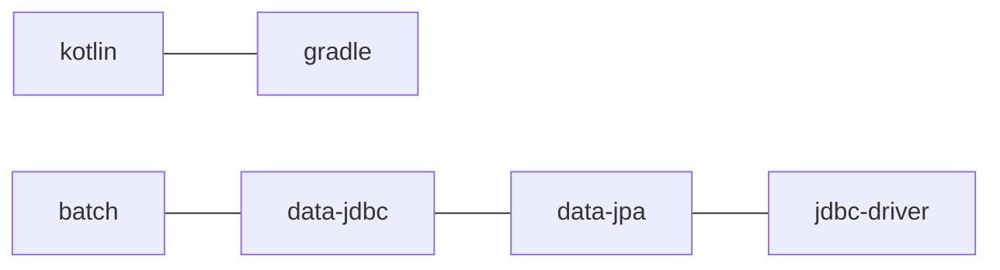

# Spring batch with multiple db

스프링에서 두개 이상의 데이터베이스와 연결하여 사용하는 예제로 배치를 만들어 보기로 했다.
두개의 데이터베이스를 어떻게 구성하고 스프링에서 어떻게 활용하는지 체크해보자.

프로젝트의 목적은 외부 데이터베이스의 부서 테이블을 읽어 메인 데이터베이스의 부서 테이블로 옮기는 것이다.


## 순서

- 1부 멀티플 데이터베이스 설정 (현재)
- 2부 배치 스텝과 잡 설정

## 프로젝트 생성

우선 기본 스프링 이니셜라이저를 통해 프로젝트를 생성한다.
코틀린을 이용한 프로젝트를 생성한다. 생성시 선택한 디펜던시 및 도구는 다음과 같다.



## 스프링 환경설정

스프링의 기본적인 환경을 application.yml 파일을 통해 설정한다.
메인 데이터베이스와 세컨드 데이터베이스이다.

```yaml
# src/main/resources/application.yml
spring:
  batch:
    jdbc:
      initialize-schema: always
  jpa:
    hibernate:
      ddl-auto: none
      naming:
        physical-strategy: org.hibernate.boot.model.naming.CamelCaseToUnderscoresNamingStrategy
        implicit-strategy: org.springframework.boot.orm.jpa.hibernate.SpringImplicitNamingStrategy
    show-sql: false
  datasource:
    driver-class-name: first-db-driver
    url: first-db-url
    username: first-db-user
    password: first-db-pass
    
# src/main/resources/input-datasource.yml
input:
  jpa:
    hibernate:
      ddl-auto: none
      naming:
        physical-strategy: org.hibernate.boot.model.naming.CamelCaseToUnderscoresNamingStrategy
        implicit-strategy: org.springframework.boot.orm.jpa.hibernate.SpringImplicitNamingStrategy
  datasource:
    driver-class-name: second-db-driver
    url: second-db-url
    username: second-db-user
    password: second-db-pass
```

## 데이터베이스 설정

### entity 클래스

JPA 데이터를 받아오거나 저장하기 위해 엔티티를 정의해야 한다. 

#### 메인 엔티티

메인 데이터베이스에 저장하기 위한 `@Entity` 클래스를 생성한다.
이때 데이터베이스에 따라 패키지를 분리해 주어야 한다.

```kotlin
package com.example.entity.main

import jakarta.persistence.Entity
import jakarta.persistence.Id
import jakarta.persistence.Table

@Entity
@Table(name = "department")
data class MainDepartment(
    @Id
    var deptCode: String,
    var deptName: String,
    var parentCode: String?,
    var lvl: Int,
    var sortNumber: Int?,
    var isEnable: Boolean
)
```

#### 서브 엔티티

서브 데이터베이스에서 데이터를 가져오기 위한 `@Entity` 클래스다.

```kotlin
package com.example.entity.input

import jakarta.persistence.Entity
import jakarta.persistence.Id
import jakarta.persistence.Table

@Entity
@Table(name = "department")
data class InputDepartment(
    @Id
    var departmentCode: String,
    var departmentName: String,
    var parentDepartmentCode: String?,
    var departmentDepth: Int,
    var orderSequence: Int?,
    var isDeleted: Boolean,
)
```

### 공통설정

하나의 데이터베이스만 활용할 때는 상관이 없지만,
다중 데이터베이스를 활용할 때는 스프링부트에서 데이터소스 관련 설정이 자동으로 구성되지 않는다.

따라서 두개의 데이터베이스 관련 설정은 해야 하는데 공통 설정 부분을 분리해 낸 것이다.

```kotlin
package com.example.config.support

import com.zaxxer.hikari.HikariDataSource
import org.springframework.beans.factory.ObjectProvider
import org.springframework.boot.autoconfigure.jdbc.DataSourceProperties
import org.springframework.boot.autoconfigure.orm.jpa.HibernateProperties
import org.springframework.boot.autoconfigure.orm.jpa.HibernateSettings
import org.springframework.boot.autoconfigure.orm.jpa.JpaProperties
import org.springframework.boot.orm.jpa.EntityManagerFactoryBuilder
import org.springframework.context.annotation.Configuration
import org.springframework.orm.jpa.JpaVendorAdapter
import org.springframework.orm.jpa.LocalContainerEntityManagerFactoryBean
import org.springframework.orm.jpa.persistenceunit.PersistenceUnitManager
import org.springframework.orm.jpa.vendor.AbstractJpaVendorAdapter
import org.springframework.orm.jpa.vendor.HibernateJpaVendorAdapter
import org.springframework.transaction.annotation.EnableTransactionManagement
import javax.sql.DataSource

@Configuration(proxyBeanMethods = false)
@EnableTransactionManagement
class SpringDataConfig {

    companion object {

        fun initializeDataSource(
            dataSourceProperties: DataSourceProperties
        ): HikariDataSource {
            return dataSourceProperties
                .initializeDataSourceBuilder()
                .type(HikariDataSource::class.java)
                .build()
        }

        fun createEntityManagerFactory(
            persistenceUnitManagerProvider: ObjectProvider<PersistenceUnitManager>,
            jpaProperties: JpaProperties,
            hibernateProperties: HibernateProperties,
            dataSource: DataSource,
            exampleEntityClass: Class<*>,
            persistenceUnit: String
        ): LocalContainerEntityManagerFactoryBean {
            return createEntityManagerFactoryBuilder(
                persistenceUnitManagerProvider.ifAvailable,
                jpaProperties,
                hibernateProperties
            )
                .dataSource(dataSource)
                .packages(exampleEntityClass)
                .persistenceUnit(persistenceUnit)
                .build()
        }

        private fun createEntityManagerFactoryBuilder(
            persistenceUnitManager: PersistenceUnitManager?,
            jpaProperties: JpaProperties,
            hibernateProperties: HibernateProperties
        ): EntityManagerFactoryBuilder {
            val jpaVendorAdapter = createJpaVendorAdapter(jpaProperties)
            val expandedProperties =
                hibernateProperties.determineHibernateProperties(jpaProperties.properties, HibernateSettings())
            return EntityManagerFactoryBuilder(jpaVendorAdapter, expandedProperties, persistenceUnitManager)
        }

        private fun createJpaVendorAdapter(jpaProperties: JpaProperties): JpaVendorAdapter {
            val adapter: AbstractJpaVendorAdapter = HibernateJpaVendorAdapter()
            adapter.setShowSql(jpaProperties.isShowSql)
            adapter.setDatabasePlatform(jpaProperties.databasePlatform)
            adapter.setGenerateDdl(jpaProperties.isGenerateDdl)
            if (jpaProperties.database != null) {
                adapter.setDatabase(jpaProperties.database)
            }
            return adapter
        }
    }
}
```

### 메인 데이터베이스 설정

```kotlin
package com.example.config

import com.example.config.support.SpringDataConfig
import com.example.entity.main.MainDepartment
import jakarta.persistence.EntityManagerFactory
import org.springframework.beans.factory.ObjectProvider
import org.springframework.beans.factory.annotation.Qualifier
import org.springframework.boot.autoconfigure.jdbc.DataSourceProperties
import org.springframework.boot.autoconfigure.orm.jpa.HibernateProperties
import org.springframework.boot.autoconfigure.orm.jpa.JpaProperties
import org.springframework.boot.context.properties.ConfigurationProperties
import org.springframework.context.annotation.Bean
import org.springframework.context.annotation.Configuration
import org.springframework.context.annotation.Primary
import org.springframework.data.jpa.repository.config.EnableJpaRepositories
import org.springframework.orm.jpa.JpaTransactionManager
import org.springframework.orm.jpa.LocalContainerEntityManagerFactoryBean
import org.springframework.orm.jpa.persistenceunit.PersistenceUnitManager
import javax.sql.DataSource


@Configuration(proxyBeanMethods = false)
@EnableJpaRepositories(
    entityManagerFactoryRef = "mainEntityManagerFactory",
    transactionManagerRef = "mainTransactionManager",
    basePackages = ["com.example.entity.main"],
)
class MainDatasourceConfig {
    companion object {
        const val MAIN_TRANSACTION_MANAGER = "mainTransactionManager"
    }

    @Primary
    @Bean
    @ConfigurationProperties("spring.datasource")
    fun mainDataSourceProperties(): DataSourceProperties {
        return DataSourceProperties()
    }

    @Primary
    @Bean
    @ConfigurationProperties("spring.datasource.hikari")
    fun mainDataSource(
        @Qualifier("mainDataSourceProperties")
        dataSourceProperties: DataSourceProperties
    ): DataSource {
        return SpringDataConfig.initializeDataSource(dataSourceProperties)
    }

    @Primary
    @Bean
    fun mainEntityManagerFactory(
        persistenceUnitManagerProvider: ObjectProvider<PersistenceUnitManager>,
        springJpaProperties: JpaProperties,
        springHibernateProperties: HibernateProperties,
        @Qualifier("mainDataSource") springDataSource: DataSource
    ): LocalContainerEntityManagerFactoryBean? {
        return SpringDataConfig.createEntityManagerFactory(
            persistenceUnitManagerProvider,
            springJpaProperties,
            springHibernateProperties,
            springDataSource,
            MainDepartment::class.java,
            "main-persistence-unit"
        )
    }

    @Primary
    @Bean(MAIN_TRANSACTION_MANAGER)
    fun mainTransactionManager(
        @Qualifier("mainEntityManagerFactory")
        entityManagerFactory: EntityManagerFactory
    ): JpaTransactionManager {
        return JpaTransactionManager(entityManagerFactory)
    }

}
```

### 서브 데이터베이스 설정

```kotlin
package com.example.config.support

import org.springframework.beans.factory.config.YamlPropertiesFactoryBean
import org.springframework.core.env.PropertiesPropertySource
import org.springframework.core.env.PropertySource
import org.springframework.core.io.support.EncodedResource
import org.springframework.core.io.support.PropertySourceFactory
import java.util.Properties


class YamlPropertySourceFactory : PropertySourceFactory {
    override fun createPropertySource(name: String?, resource: EncodedResource): PropertySource<*> {
        val factory = YamlPropertiesFactoryBean()
        factory.setResources(resource.resource)

        val properties: Properties = factory.getObject()!!

        return PropertiesPropertySource(resource.resource.filename!!, properties)
    }
}
```

```kotlin
package com.example.config

import com.example.config.support.SpringDataConfig
import com.example.config.support.YamlPropertySourceFactory
import com.example.entity.input.InputDepartment
import jakarta.persistence.EntityManagerFactory
import org.springframework.beans.factory.ObjectProvider
import org.springframework.beans.factory.annotation.Qualifier
import org.springframework.boot.autoconfigure.jdbc.DataSourceProperties
import org.springframework.boot.autoconfigure.orm.jpa.HibernateProperties
import org.springframework.boot.autoconfigure.orm.jpa.JpaProperties
import org.springframework.boot.context.properties.ConfigurationProperties
import org.springframework.context.annotation.Bean
import org.springframework.context.annotation.Configuration
import org.springframework.context.annotation.PropertySource
import org.springframework.core.env.Environment
import org.springframework.data.jpa.repository.config.EnableJpaRepositories
import org.springframework.orm.jpa.JpaTransactionManager
import org.springframework.orm.jpa.LocalContainerEntityManagerFactoryBean
import org.springframework.orm.jpa.persistenceunit.PersistenceUnitManager
import javax.sql.DataSource


@Configuration(proxyBeanMethods = false)
@EnableJpaRepositories(
    entityManagerFactoryRef = "inputEntityManagerFactory",
    transactionManagerRef = "inputTransactionManager",
    basePackages = ["com.example.entity.input"]
)
@PropertySource(
    value = ["classpath:/input-datasource.yml"],
    factory = YamlPropertySourceFactory::class
)
class InputDataSourceConfig(
    private val env: Environment
) {
    companion object {
        const val INPUT_TRANSACTION_MANAGER = "inputTransactionManager"
    }

    @Bean
    @ConfigurationProperties("input.datasource")
    fun inputDataSourceProperties(): DataSourceProperties {
        return DataSourceProperties()
    }

    @Bean
    @ConfigurationProperties("input.datasource.hikari")
    fun inputDataSource(
        @Qualifier("inputDataSourceProperties")
        inputDataSourceProperties: DataSourceProperties
    ): DataSource {
        return SpringDataConfig.initializeDataSource(inputDataSourceProperties)
    }

    @Bean
    fun inputEntityManagerFactory(
        persistenceUnitManagerProvider: ObjectProvider<PersistenceUnitManager>,
        springJpaProperties: JpaProperties,
        springHibernateProperties: HibernateProperties,
        @Qualifier("inputDataSource") springDataSource: DataSource
    ): LocalContainerEntityManagerFactoryBean? {
        return SpringDataConfig.createEntityManagerFactory(
            persistenceUnitManagerProvider,
            springJpaProperties,
            springHibernateProperties,
            springDataSource,
            InputDepartment::class.java,
            "input-persistence-unit"
        )
    }

    @Bean(INPUT_TRANSACTION_MANAGER)
    fun transactionManager(
        @Qualifier("inputEntityManagerFactory")
        entityManagerFactory: EntityManagerFactory
    ): JpaTransactionManager {
        return JpaTransactionManager(entityManagerFactory)
    }
}
```

---

전체 프로젝트 소스는 [GitHub Repository](https://github.com/k1005/spring-batch-multiple-db)에 저장되어 있다.